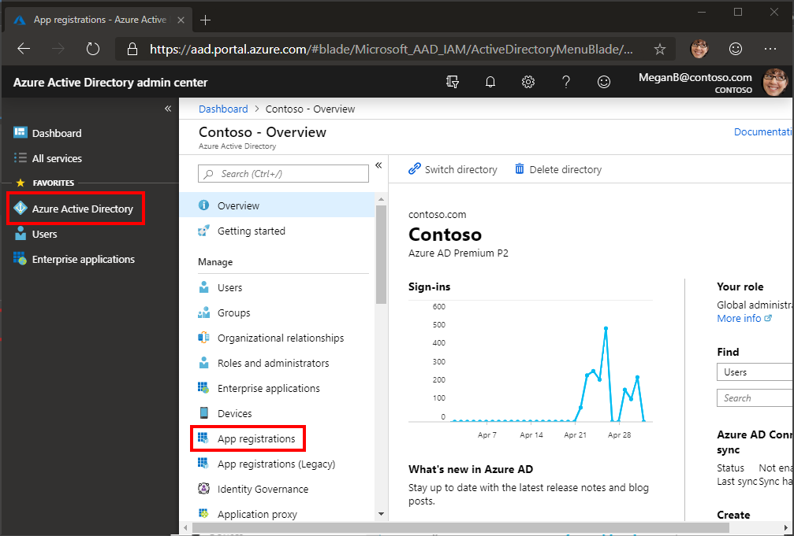
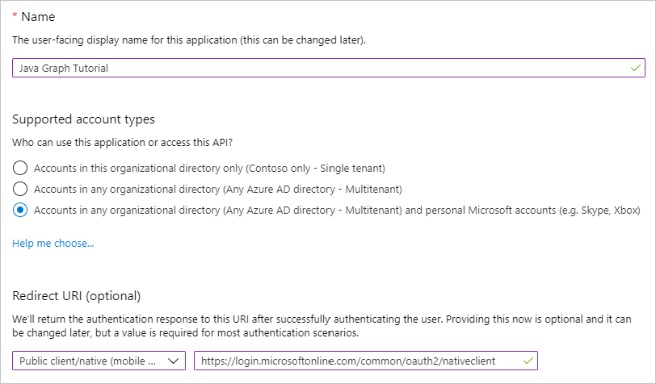
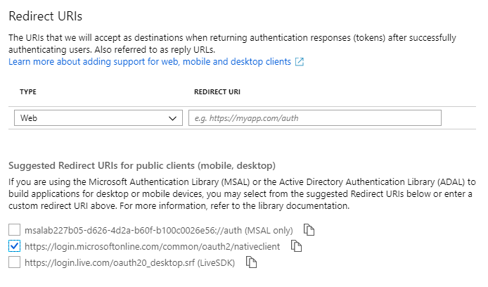

<!-- markdownlint-disable MD002 MD041 -->

Dans cet exercice, vous allez créer une nouvelle application Azure AD à l’aide du centre d’administration Azure Active Directory.

1. Ouvrez un navigateur, accédez au [Centre d’administration Azure Active Directory ](https://aad.portal.azure.com) et connectez-vous à l’aide d’un **compte personnel** (ou compte Microsoft) ou d’un **compte professionnel ou scolaire**.

1. Sélectionnez **Azure Active Directory** dans le volet de navigation gauche, puis sélectionnez **Inscriptions d’applications** sous **Gérer**.

    

1. Sélectionnez **Nouvelle inscription**. Sur la page **Inscrire une application**, définissez les valeurs comme suit.

    - Définissez le **Nom** sur `Java Graph Tutorial`.
    - Définissez les **Types de comptes pris en charge** sur **Comptes dans un annuaire organisationnel et comptes personnels Microsoft**.
    - Laissez **Redirect URI** vide.

    

1. Choisissez **Inscrire**. Sur la page **didacticiel de Graph Java** , copiez la valeur de l' **ID d’application (client)** et enregistrez-la, vous en aurez besoin à l’étape suivante.

    

1. Sélectionnez le lien **Ajouter un URI de redirection** . Sur la page **URI de redirection** , recherchez la section **URI de redirection suggérée pour les clients publics (mobile, bureau)** . Sélectionnez l' `https://login.microsoftonline.com/common/oauth2/nativeclient` URI.

    

1. Recherchez la section **type de client par défaut** et modifiez le paramètre **traiter l’application comme un client public** sur **Oui**, puis cliquez sur **Enregistrer**.

    
